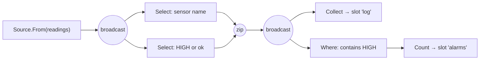

# Branching

*What happens to ordering, completion, and memory when a pipeline stops being a
line?*

A linear pipeline has one obvious answer to every question: one element in flight,
one order, one place the stream ends. Add a stage with two outputs or two inputs
and each of those answers splits. This page is about the nine
[junctions](../reference/glossary.md#junction) the library gives you, what each
one is *for*, and the three things every one of them changes.

## The five rules every junction obeys

Before the individual contracts, the shared ones. These hold for all nine.

1. **Failure wins.** Any input's failure fails the junction, the run, and
   everything downstream — immediately, and whether or not that input was the one
   being read. A failure on a leg nobody is currently reading is still the run's
   failure.
2. **Demand is a pull.** A junction pulls an input only when it has downstream
   demand it can satisfy from that input. No junction reads ahead beyond the
   elements its own contract says it holds.
3. **A completed downstream leg stops feeding, not the world.** When one output's
   downstream completes, a fan-out stops offering to that leg and keeps feeding
   the rest. The junction completes upstream only when **every** output has
   completed.
4. **Per-input order is preserved.** No junction reorders the elements of one
   input relative to each other. What it promises *across* inputs is its own
   contract, stated below.
5. **A junction is a [boundary](../reference/glossary.md#boundary).** It holds
   elements, and how many is part of its contract. That is the third of the three
   ways a pipeline holds more than one element at a time — see
   [Pull and backpressure](pull-and-backpressure.md#the-three-boundaries).

## Fan-out: one input, several outputs

| Junction | What it is *for* | Pulls upstream when | Holds |
|---|---|---|---|
| [`Broadcast`](../reference/glossary.md#broadcast) | Two things must both see the **whole** stream. | **every** live leg has room | 1 element |
| [`Balance`](../reference/glossary.md#balance) | Spreading work across identical workers. | **any** leg has room | 1 element |
| [`Partition`](../reference/glossary.md#partition) | Classifying — by region, tenant, priority. | it holds no routed element | 1 element |
| [`Unzip`](../reference/glossary.md#unzip) | A composite element whose parts go different ways. | **both** legs have room | 1 element |

**Broadcast** is slowest-consumer backpressure by construction. Because the pull
happens only when every live leg can take the element, one slow leg paces the
whole stream — and nothing anywhere accumulates on its behalf. That is what a
broadcast is bought for and it is also its cost: a branch that stops consuming
stops all of them.

**Balance** makes no promise about *which* leg gets an element. It goes to
whichever is ready, round-robin among the willing so that distribution is fair on
an idle system rather than accidentally sticky. Over 100 elements into two legs
you get something like 51 and 49 — a split that is not reproducible and is not
meant to be:

```text
left 51 + right 49 = 100, overlap 0
```

Read the invariants rather than the numbers: every element went to exactly one
leg, and none went to two. Code that needs to know which leg uses `Partition`.

**Partition** runs your routing function once per element and then waits for
*that element's* target specifically, which is head-of-line blocking one element
deep: while the routed element waits for its leg, every other leg starves.

```csharp
RunnableGraph partitioned = Source.From(new[] { 1, 2, 3, 4, 5, 6, 7 })
    .PartitionTo(
        n => n % 3,
        Flow.For<int>().To(Sink.Collect<int>(new CollectOptions { MaxElements = 16 }), "r0", out ResultSlot<IReadOnlyList<int>> r0),
        Flow.For<int>().To(Sink.Collect<int>(new CollectOptions { MaxElements = 16 }), "r1", out ResultSlot<IReadOnlyList<int>> r1),
        Flow.For<int>().To(Sink.Collect<int>(new CollectOptions { MaxElements = 16 }), "r2", out ResultSlot<IReadOnlyList<int>> r2));
```

```text
leg 0 [3, 6]
leg 1 [1, 4, 7]
leg 2 [2, 5]
```

Two edge cases are decided rather than left to chance. A routing answer outside
the wired legs **fails the run** — a misrouted element has no honest destination,
and dropping it silently would be worse. An element routed to a leg that has
already *left* — because its own downstream completed — is abandoned rather than
failed on, because failing there would race an ordinary early completion.

**Unzip** takes a two-part element and sends each part to its own leg. It is a
broadcast in its flow control — both legs must have room before the pull — and a
split in its elements, so the two legs advance in lockstep and can be re-zipped
downstream without skew. It is the one fan-out whose legs are differently typed,
and the one whose arity is fixed at two, because the halves of a pair are two and
each half's type is a type argument.

```csharp
RunnableGraph unzipped = Source.From(new[] { 1, 2, 3 })
    .Select(n => (Left: n, Right: n.ToString() + "!"))
    .UnzipTo(
        Flow.For<int>().To(s => s.Aggregate(0L, (sum, n) => sum + n), "sum", out ResultSlot<long> sumSlot),
        Flow.For<string>().To(Sink.Collect<string>(new CollectOptions { MaxElements = 8 }), "text", out ResultSlot<IReadOnlyList<string>> textSlot));
```

```text
sum 6, text [1!, 2!, 3!]
```

## Fan-in: several inputs, one output

The completion column is the one to study. "When does a fan-in finish?" has five
different answers and picking the wrong junction gets you the wrong one.

| Junction | What it is *for* | Emits | **Completes when** | Holds |
|---|---|---|---|---|
| [`Merge`](../reference/glossary.md#merge) | Several equivalent feeds into one stream. | any input's element, as available | **all** inputs complete | 1 element |
| [`Concat`](../reference/glossary.md#concat) | Order across the legs is the point. | input 0 entirely, then input 1, … | the **last** input completes | 1 element |
| [`Interleave`](../reference/glossary.md#interleave) | A deterministic merge. | K elements per input, in fixed rotation | **all** inputs complete | 1 element |
| [`Zip`](../reference/glossary.md#zip) | Pairing streams positionally into rows. | one row per element from **each** input | **any** input completes | N−1 elements |
| [`CombineLatest`](../reference/glossary.md#combine-latest) | A dashboard: latest of everything, refreshed on any change. | a row on every arrival, once every input has produced once | **all** inputs complete | N elements |

Here are all five over the same two legs — `[2, 4, 6]` and `[1, 3, 5, 7, 9]`:

```text
merge        8 elements  [2, 1, 4, 3, 6, 5, 7, 9]
concat       8 elements  [2, 4, 6, 1, 3, 5, 7, 9]
interleave   8 elements  [2, 4, 1, 3, 6, 5, 7, 9]
zip          3 elements  [21, 43, 65]
combine      7 elements  [21, 41, 43, 63, 65, 67, 69]
```

Read the element counts first. Merge, concat and interleave all deliver all eight
— they combine streams without consuming them against each other. **Zip delivers
three**, because it pairs positionally and the shorter leg has three elements;
the other leg's remaining two are never emitted, and that is the eager-completion
rule doing exactly what it says. **CombineLatest delivers seven**: one row per
arrival after both legs have produced at least once, so the very first arrival
emits nothing and everything after it emits a row.

Now the ordering.

**Merge** promises nothing across inputs. The order above is an *observation*,
not a contract; do not build on it. What merge does promise is that a fast
producer cannot starve a slow one's elements once they have arrived, because the
pump reads round-robin among ready inputs.

**Concat** gives demand only to the active input, and inputs behind it are not
read at all until their turn. That is the contract, and there is a consequence
worth knowing: the engine still *launches* every segment, so a later input's
source runs — up to its boundary's capacity plus the one element in its hand —
and a source that fails when it is opened fails the run at once rather than at
its turn. What concat withholds is reads, and what that buys is backpressure on
the waiting inputs, not deferred startup. A source that must not be touched until
its turn expresses that in the source, not in the junction.

**Interleave** takes a declared number of elements from each input in fixed
rotation — the `2` in the trace above. When an input completes, the rotation
continues over what is left. It is merge with determinism bought at the price of
head-of-line waiting on whichever input's turn it is.

**Zip** advances at the speed of its slowest leg by construction, and the N−1
elements it holds are the partial row waiting for its slowest column. There is no
other buffering, and there is no way for a fast leg to run ahead.

**CombineLatest** completes when **all** inputs complete, freezing a completed
leg's last value into later rows. The alternative — completing on the first
completion — would end a dashboard the moment its least important feed did, which
is the opposite of what the operator exists for.

## The authoring shapes

A branching graph is built differently from a linear one, and the reason is worth
one paragraph because it explains a piece of syntax that otherwise looks
arbitrary.

Type information flows **left to right**, from a source. A junction's leg is
built **right to left** — you know its sink, then the flow ahead of it — so a
free-standing leg has no receiver to carry its input type, and inference has
nothing to work from. The anchor is `Flow.For<T>()`, the identity flow, whose one
explicit type argument stands exactly where a reader wants the leg's input type
stated anyway. Everything after that anchor infers: factory members, fold seeds,
slot types.

### A branch

A [branch](../reference/glossary.md#branch) is a leg that **ends in a sink**. It
is a value like everything else here:

```csharp
Branch<OrderDocument> largeBranch = Flow.For<OrderDocument>()
    .Where(document => document.Amount >= Large)
    .To(Sink.Count<OrderDocument>(), "large", out ResultSlot<long> largeSlot);
```

Fan-out is then a **terminal call on the source**, the way `To` closes a chain —
the branches end in sinks, so nothing is left open:

```csharp
RunnableGraph graph = Source.From(orders)
    .Select(OrderDocument.FromEvent)
    .BroadcastTo(largeBranch, northBranch);
```

> From the `junctions` scenario,
> [`samples/Orleans.Dataflow.Samples/CSharp/Junctions.cs`](../../samples/Orleans.Dataflow.Samples/CSharp/Junctions.cs),
> which runs it over twelve orders and reports both counts from one pass:
>
> ```text
> orders-broadcast          12
> orders-worth-50-or-more    6
> orders-from-the-north      4
> ```

Two rules about branches:

- **Branch order is argument order, and it is identity-bearing.** Swapping two
  arguments numbers the occurrences differently and builds a different document
  with a different [fingerprint](../reference/glossary.md#fingerprint). That is
  the same rule reordering a chain follows.
- **A branch that declares a result closes exactly one graph.** Its slot is
  assigned one expression *before* there is a document to fingerprint, so the
  slot binds when the junction call closes the graph; using such a branch in a
  second graph is refused rather than quietly repointing the first graph's slot.
  A branch that declares no result stays reusable without limit.

Fan-in, in contrast, is a **combinator on sources** — each call returns a
`Source` and the chain simply continues:

```csharp
Source<int> combined = Source.From(evens).Merge(Source.From(odds));
```

Two- and three-input overloads exist; wider graphs chain — `a.Merge(b).Merge(c)`
— and the chain is honest about being two nodes. Merge semantics are associative,
but the two documents are distinct and fingerprint differently, and nothing
rewrites one into the other behind your back.

A local junction takes between **2 and 8** legs, and both ends of that are
refused rather than tolerated:

```text
A fan-out junction has between 2 and 8 branches, and this call has 1. One branch is a chain
written the long way, none is a discarding sink, and more than 8 is past the legs a local
junction declares.
```

### A fork

A [fork](../reference/glossary.md#fork) is the one authoring value with **two
open ends**, and that is the whole reason it exists. Everything else here has
one: a source is one stream, a branch is one leg ending in a sink. Re-convergence
— the same elements going two ways and meeting again — cannot be written as a
tree, so it gets a carrier:

```csharp
RunnableGraph forked = Source.From(new[] { 1, 2, 3, 4 })
    .Fork(
        Flow.For<int>().Select(n => n * n),
        Flow.For<int>().Select(n => -n))
    .Zip((square, negative) => $"{square}/{negative}")
    .To(Sink.Collect<string>(new CollectOptions { MaxElements = 8 }), "rows", out ResultSlot<IReadOnlyList<string>> rows);
```

```text
[1/-1, 4/-2, 9/-3, 16/-4]
```

A fork's rejoin is deterministic where a zip of two unrelated sources is only
positional: both sides descend from one broadcast, so they advance together and
the pairing is guaranteed to be the two derivations of the same input element.
That is also why the rejoin is legal with no buffer between the arms.
`ForkMerge` is the other rejoin, for when both arms produce the same type and the
answer you want is whichever finishes first.

### A tap

`AlsoTo(branch)` is broadcast sugar for the case where you want a side effect and
the main line to keep flowing:

```csharp
RunnableGraph tap = Source.From(new[] { 1, 2, 3 })
    .AlsoTo(Flow.For<int>().To(s => s.ForEach(tapped.Add)))
    .Select(n => n * 100)
    .To(Sink.Collect<int>(new CollectOptions { MaxElements = 8 }), "main", out ResultSlot<IReadOnlyList<int>> main);
```

```text
main [100, 200, 300], tapped [1, 2, 3]
```

It is a broadcast, so it has a broadcast's flow control: **a tap that stops
consuming stops the main line too.** Hold the tap still over a source of twenty
and the main line gets exactly two — one at its sink, one on the way — and then
nothing:

```text
main line got 2 of 20 while the tap stood still
in the end the main line saw 20
```

A tap is therefore not a fire-and-forget side channel. If the side effect can be
slow, put a buffer with a dropping policy on the tap's own leg and decide what
gets lost.

## A worked example

One source, forked two ways, rejoined into a row, and then broadcast into two
branches that answer different questions about the same rows.



```csharp
record Reading(string Sensor, int Value);

Branch<string> log = Flow.For<string>()
    .To(Sink.Collect<string>(new CollectOptions { MaxElements = 32 }), "log", out ResultSlot<IReadOnlyList<string>> logSlot);

Branch<string> alarms = Flow.For<string>()
    .Where(line => line.Contains("HIGH", StringComparison.Ordinal))
    .To(Sink.Count<string>(), "alarms", out ResultSlot<long> alarmSlot);

RunnableGraph graph = Source.From(readings)
    .Fork(
        Flow.For<Reading>().Select(r => r.Sensor.ToUpperInvariant()),
        Flow.For<Reading>().Select(r => r.Value >= 80 ? "HIGH" : "ok"))
    .Zip((sensor, level) => $"{sensor}:{level}")
    .BroadcastTo(log, alarms);

await using RunHandle run = await new LocalDataflowHost().MaterializeAsync(graph);

IReadOnlyList<string> lines = await run.GetValueAsync(logSlot);
long alarmCount = await run.GetValueAsync(alarmSlot);
```

Over four readings — `(a, 12)`, `(b, 91)`, `(a, 7)`, `(b, 88)`:

```text
log    [A:ok, B:HIGH, A:ok, B:HIGH]
alarms 2
graph  sha256:b14c35945c6a70fa1823e95fc22edad30c100a7aaa7b27d2bd1c423dc0c39fe3 (9 nodes, 2 result slots)
```

Nine nodes and two slots for four lines of authoring — the two broadcasts and the
zip are stages in the document exactly as the selects are. Trace the memory: the
first broadcast holds one element per leg, the zip holds one (N−1 for N=2), the
second broadcast holds one per leg. Whatever the reading count, that is the whole
of it.

## What branching costs

Say it plainly, because the fan-out looks free and is not.

- **Throughput.** Crossing a boundary is what costs in this engine, and a
  junction is a boundary. In the published benchmark a broadcast into two sinks
  runs at about 88,000 elements per second where a fused chain runs at about 12.6
  million — two orders of magnitude, on the same machine, over the same million
  elements. Branch because the shape needs it, not because it reads nicely.
- **Deployability.** A junction authored through the fluent surface is itself a
  local, unnamed stage, so a branching graph is local-only even when its source,
  its flows and its branch sinks are all registered. Making a branching pipeline
  deployable needs a provider that registers the junction itself.
- **A cycle needs a relieving boundary.** A loop is legal only when every cycle
  passes through a boundary that can hold an element and answer without waiting
  for its own downstream — that is, a buffer whose overflow policy is anything
  but `Backpressure`. A cycle of nothing but backpressuring edges is a deadlock
  by construction, so it is refused before execution with the cycle's node path
  in the diagnostic. A delay does not qualify: it holds elements for a time and
  then waits for room below exactly as a backpressuring buffer does. Cycles have
  no fluent spelling and are authored through the fragment surface, where edges
  are explicit.

## Where to go next

- [Branching and joining](../guides/branching-and-joining.md) — complete programs
  for the common shapes.
- [Pull and backpressure](pull-and-backpressure.md) — why a junction is a
  boundary and what that bounds.
- [Operators](../reference/operators.md) — every junction's C# and F# spelling.
- [Graphs and identity](graphs-and-identity.md) — why branch order changes the
  fingerprint.
