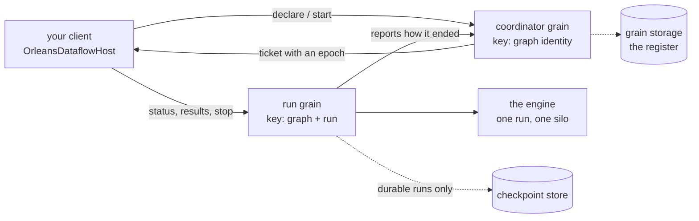

# The cluster model

*What runs where, who owns what, and who is allowed to call what?*

Running a pipeline on an Orleans cluster changes almost nothing about what the
pipeline means and quite a lot about what can go wrong. This page is about the
pieces — silos, grains, activations, a coordinator, a run — what happens when one
of them dies, how ownership is decided when two processes both think they have a
run, and the trust statement you have to read before you deploy any of it.

## The pieces, in plain terms

A [**silo**](../reference/glossary.md#silo) is one Orleans server process. You
register this library on it, and from then on it can host runs.

A [**grain**](../reference/glossary.md#grain) is Orleans' unit of addressable,
single-threaded state — an object with a name, which the runtime places somewhere
in the cluster and calls one message at a time. An
[**activation**](../reference/glossary.md#activation) is one in-memory instance
of a grain. Orleans creates activations when somebody calls a grain and recycles
them when it sees fit, which is the single most important thing to internalize:
**an activation is not something you own.**

This library uses two grains.

The [**coordinator**](../reference/glossary.md#coordinator) is named by a graph
identity, and there is one per pipeline. It owns the register for that pipeline:
it starts runs, issues run identities, hands out ownership numbers, remembers
which [durable runs](../reference/glossary.md#durable-run) have been declared and
under which document, and records how runs ended.

The **run grain** is named by a graph identity and a run identity, and there is
one per run. It validates the document against **its own silo's**
[catalog](../reference/glossary.md#catalog), builds the execution plan, drives
the engine, and reports the terminal state back to its coordinator.



## Runs distribute before stages do

Here is the central decision, and it is worth understanding before anything else.

**A run executes as one logical unit on one silo.** The engine hosted inside the
run grain is the same engine that runs locally, with the same rules about demand,
boundaries, drain-versus-abandon and result slots. Orleans-native stages — a
stream source, a grain-call sink — are *adapters inside* that run rather than
separate distributed pieces.

What you get: every guarantee the local engine makes survives being hosted on a
cluster, because it is the same code with the same tests behind it. The Orleans
layer is additive.

What you pay, stated plainly: **one run is bounded by one silo's capacity.**
Scale-out is per run — many runs across many silos — and, for one specific stage
described below, per key. It is not per arbitrary stage. A design that put each
stage in its own grain would have to re-litigate every boundary semantic across a
network hop and turn every fused chain into a distributed system.

The one exception is a **keyed grain call**, which may opt in to distribution per
occurrence. When it does, each key gets an executor grain and the cluster places
it; when it does not — the default — the calls are made from inside the run and
the key only orders them. That is the first stage allowed to distribute below its
run, and it does so because a document asked, not because it could.

Two facts about a keyed call are worth carrying:

- **Exactly one call is in flight per key.** That is where the per-key ordering
  promise comes from — it is a property of the run's own accounting, not of the
  transport, and it is therefore as true on fifty silos as on one.
- **Ordering across activations is not something Orleans promises**, and this was
  measured rather than assumed. A caller pumping 200 sequenced calls at one
  callee without awaiting between them saw arrivals reordered in every round of
  every shape tried, inside a single in-process silo where every hop is local
  delivery: on one run the first of 200 arrivals from a grain caller was the
  **14th** call sent. More than one in flight per key was never legal, and there
  is deliberately no parameter that would let you ask for it.

## Registration

```csharp
_ = builder.UseOrleans(silo =>
{
    _ = silo.UseLocalhostClustering();
    _ = silo.AddMemoryGrainStorage(OrleansDataflowStorage.CoordinatorProviderName);

    _ = silo.AddOrleansDataflow(dataflow => dataflow
        .AddCatalog(SampleVocabulary.Catalog())
        .AddFactory(SampleVocabulary.Provider, new SampleStageFactory()));

    // A vocabulary whose two halves ship together is one call: dataflow.AddProvider(vocabulary).

    _ = silo.Services.AddOrleansDataflowClient();
});
```

> From [`samples/Orleans.Dataflow.Samples/SampleCluster.cs`](../../samples/Orleans.Dataflow.Samples/SampleCluster.cs).
> Nothing there is a test facility: it is the generic host, `UseOrleans`, a
> clustering provider, a grain storage provider for the coordinator's register,
> and one call carrying this deployment's vocabulary.

Two rules that a deployment learns the hard way otherwise:

- **Every silo that may host runs registers the same stages, under the same
  names, at the same versions.** The coordinator refuses a document a silo cannot
  resolve, and a rolling upgrade is exactly the window in which silos disagree.
- **Every silo that may host a *durable* run also registers a checkpoint store,
  and the same store.** Nothing supplies a default, because an in-memory default
  would let a deployment believe its runs were durable while their positions died
  with the process. A silo with no store is a legal configuration; what it refuses
  is a durable *declaration*, by name, at the declaration rather than at the first
  capture. An ordinary run on the same silo is unaffected.

Materializing looks the way it does locally:

```csharp
await using OrleansRunHandle run = await sample.Cluster.MaterializeAsync(pipeline, cancellationToken);

RunEnding ending = await run.WatchTermination;
long tally = await run.GetValueAsync(accepted, cancellationToken);
RunSnapshot snapshot = await run.SnapshotAsync(cancellationToken);
```

> From the `cluster` scenario,
> [`samples/Orleans.Dataflow.Samples/CSharp/Cluster.cs`](../../samples/Orleans.Dataflow.Samples/CSharp/Cluster.cs),
> which reports:
>
> ```text
> orders-the-feed-emitted     12
> orders-the-silo-accepted    10
> run-ending                  Completed
> run-status                  Completed
> ```

## What crosses the wire

Three rules, all of them about keeping the definition plane out of the network.

**A document travels as canonical bytes**, never as a serialized object graph. It
is the same bytes on the wire, in the store, and under the hash — which is what
makes a fingerprint computed by your client and one computed on a silo the same
number.

**No definition-plane identity type crosses a grain boundary.** Run identities,
graph identities and fingerprints travel as strings; a result slot travels as a
name plus fingerprint text. A build-time check fails any wire member typed from
the definition assembly, so drift is caught at build rather than at first send.

**Your elements are your types.** Anything crossing a grain or stream boundary
must satisfy Orleans serialization — the usual attributes or a registered
serializer. That is a requirement on you, checked at first use.

Two consequences you will meet:

- **A remote failure arrives as a type name and a message.** Your exception type
  does not survive the hop, because an exception chain is only as serializable as
  its least prepared link. `Completion` faults with an exception carrying that
  pair; `WatchTermination` resolves with the same pair as a value.
- **Grain-thrown refusals carry no inner exception**, for the same reason: an
  unserializable inner would replace the diagnosis with a codec error. The cause
  is folded into the message instead.

One more design rule, invisible until it matters: **a grain turn never parks.** A
status or result call answers "not yet" rather than awaiting; a shutdown or a
cancellation *requests* rather than draining. The engine's own dedicated threads
do the waiting. A grain that parked its turn on a running pipeline would hold that
grain's mailbox for the length of the pipeline.

## When a silo dies with a run on it

This is the question the whole cluster model exists to answer, and there are two
answers depending on one thing you declared.

**An ordinary run is lost.** Its activation is gone, and with it the run's
position, its stage state, and its results. It is reported as *lost*, which is a
different thing from *failed*: it never reached a terminal state and never will.
`WatchTermination` **faults** rather than resolving, because there is no ending to
report — and a fault there is more honest than inventing a third ending. A status
call about an attempt that no longer exists says exactly that. **Absence is not
staleness**, and the two are separate exceptions on purpose.

**A durable run that has written a checkpoint is continued.** When some later
call brings a run grain back into being — typically the client's own ordinary
status poll — the activation reads its checkpoint key on the way up. **A
checkpoint being present *means* the run is resumed**: the activation claims a
fresh ownership number, rebuilds the plan with the stored positions and states
restored, and reports that it is running. There is no second protocol; a resume
is the second half of the very path a start takes.

Note the gate carefully. It is the *checkpoint*, not the declaration. **A durable
run with no checkpoint yet is a lost attempt exactly as an ordinary run is.**
Durability is not a promise that an attempt survives; it is a promise that a
*stored position* is continued. The cost of the whole feature is therefore one
store read per activation on a silo that registers a store, and nothing at all on
a silo that does not.

**A run's ending is remembered, so a finished run stays finished.** A run grain
persists nothing itself — once its activation is gone, nothing about it
distinguishes "died mid-run" from "failed" from "completed", because a checkpoint
says *where* and never *whether*. So the run grain reports its terminal state to
its coordinator, the declaration records it, and a later claim is answered with
the ending instead of a document to continue. Without that, a durable run that had
completed would be resumed and re-run its tail.

Three details of that, each decided rather than incidental:

- **Completing and failing are endings; cancelling is not.** A deactivation
  cancels the run it was hosting, so accepting cancellation as an ending would
  retire a durable run every time its silo recycled — the exact behavior
  durability exists to prevent. The coordinator refuses it by name.
- **A finished run's checkpoint is kept, not cleared.** Where a run got to is the
  question people ask after it ends; marking the declaration is what retires the
  run, and forgetting the position stays an explicit operation.
- **A silo that dies between a run ending and the report landing loses the
  report.** Those are two genuinely separate writes and nothing here makes them
  one. What you see for that one run is a resume that replays its tail.

## Ownership, and why a number orders it

Two processes can both believe they are running one durable run. The old host may
be slow rather than dead; the network may have partitioned; a resume may have
started before the previous attempt noticed anything.

So ownership is not a boolean. It is an
[**epoch**](../reference/glossary.md#epoch) — a number, issued by the coordinator,
that only ever increases. Every attempt carries one. Every call to a run grain
carries one. A higher epoch supersedes a lower one.

Why a number rather than a lock or a lease? Because a number needs no clock and no
liveness detector to be correct. A lease has to be renewed, and renewal is exactly
what a partitioned host cannot do reliably; a lock has to be released, and a dead
holder never releases anything. A monotonic number simply makes "who is newer" a
comparison, and every participant can answer it locally with no coordination.

**Ownership is claimed by the activation that is about to host the run**, and by
nothing else. Reading a declaration — asking what a durable name currently holds —
takes nothing and fences nobody. That distinction is what makes an observer safe.

## Why a stale process is refused rather than merged

Two independent refusals, at two layers, and both are hard failures rather than
reconciliations.

**A stale epoch is refused at the grain.** A call carrying an older ownership
number than the run grain holds is rejected loudly. That is one exception; an
attempt that does not exist at all is a *different* exception, because absence and
staleness are different facts and a caller needs to tell them apart.

**A stale ETag is refused at the store.** A checkpoint write presents the ETag its
writer last saw, and a store whose version has moved on throws. **The refused
writer stops rather than retrying.** Retrying with the fresh ETag would overwrite
the position a live attempt is building with a snapshot of a run that owns
nothing — which is exactly the corruption the ETag exists to prevent.

The reason neither one merges is that there is no correct merge. Two attempts of
one run have two different pasts: different elements admitted, different partial
folds, different side effects committed. A document assembled from both describes
a run that never happened, and a resume from it would restore a state no attempt
was ever in. Refusing loses one attempt's work — which the at-least-once contract
already admits — while merging loses the *truth*, silently. The library takes the
loss it can name.

There is one place where the ordering is not enough on its own, and it is stated
rather than hidden: replacing a durable run fences the previous attempt but does
not stop it, because the coordinator member that rewrites the register may not
wait on a run grain. What actually stops it is the second hop — Orleans permits
one activation per run grain, so starting the replacement reaches the very
activation hosting the old attempt and disposes its engine. Replace through the
host, not through the coordinator alone; a caller that only rewrites the register
leaves the old attempt executing until its next capture is refused, or forever if
it declared no cadence and therefore never captures.

## Rolling upgrades

A resume chooses its host by which silo survived, so a half-upgraded cluster can
accept a durable run on one silo and be unable to execute it on the next. The
outcomes are decided:

- A resume landing on a silo that can resolve every stage of the document
  **continues**.
- A resume landing on a silo that cannot is **refused by name** — the node, the
  stage reference, and the fact that this catalog does not register it. Nothing is
  consumed and the checkpoint is untouched; the run continues when a capable silo
  picks it up, or when the roll finishes. The refusal is remembered on that
  activation rather than re-derived per poll, and it is retired by a declaration
  carrying a newer epoch.
- **A different catalog fingerprint is not a different document fingerprint.**
  What a resume compares is the checkpoint's document fingerprint against the
  document's. What it needs of a host is that every stage *resolves*, which is a
  weaker requirement than two silos publishing identical vocabularies. A run whose
  document names nothing an upgrade touched resumes onto a stale silo happily.

Where a run *starts* is decided by placement; where it *resumes* is decided by
which silo caught the activation. `UsePlacement` chooses per grain type between
the cluster default, random, prefer-local, and hash-based placement, and answers
only for this library's two grain types — a deployment that never calls it behaves
exactly as it would without it.

## Limits the coordinator enforces

Each of these refuses work rather than slowing it, and a pipeline a person wrote
never meets any of them.

| Bound | Value | Why |
|---|---|---|
| Document bytes, before decoding | 4 MiB | Starting a run is not an interleaved call, so decoding is time the whole coordinator spends — including status polls of its other runs. |
| Nodes in a document | 10,000 | The same turn, bounded by shape rather than size. |
| Durable run identities per pipeline | 1,000 | A record holds the document it names and the whole register is rewritten on every declaration, so an unbounded register eventually exceeds the storage provider's per-document limit — after which the coordinator cannot write at all and every start of that pipeline stops with it. |
| One canonical payload value | 256 KiB | Bounds the cost of validating untrusted graph data. |
| Diagnostics in one refusal | 20, then "and N more" | An uncapped refusal can be larger than the document that earned it. |

The durable-identity cap is the one to plan for. A deployment that names runs per
tenant, per day, or per import needs to give names back, and retiring a durable
run is how.

## The trust statement

Read this before you deploy anything.

**Everything connected to the cluster is inside it.** This library adds **no
per-call authorization**, and Orleans hands a grain no caller identity, so there
is nothing here that could authorize one.

Concretely, a client on the cluster's wire can:

- stop, cancel, replace, or retire **any** run whose name it can guess;
- read the results of one;
- read back the canonical document of any declared durable run — which is the
  whole pipeline's shape and every parameter in it.

Durable run identities are author-chosen names, not secrets. **Treat a pipeline
document as readable by anything that can reach the cluster.**

The protocol defends what a protocol structurally can, and **none of it is
authorization**: an ownership epoch is refused unless the coordinator issued it;
ownership is taken by the activation that is about to host the run and by nothing
else, so a bystander reading a declaration fences nobody; documents are bounded
before they are decoded; the register a declaration grows is bounded. These stop a
confused caller and a runaway script. **They do not stop a hostile one, and are
not meant to.**

The obligations that follow are your deployment's:

- **Do not expose the Orleans gateway to untrusted clients.**
- **Use Orleans' own connection-level authentication and TLS, and isolate the
  cluster's network.**
- **If one cluster hosts more than one tenant, put an `IIncomingGrainCallFilter`
  in front of these grains.** That seam is Orleans', it is where per-call identity
  belongs, and this library deliberately does not occupy it.

## Where to go next

- [Deploying](../operations/deploying.md) — what a silo and a client need, and
  what the deployment owes the library.
- [Runbooks](../operations/runbooks.md) — replacing a run, retiring a name,
  rolling an upgrade, recovering from a store outage.
- [Durability](durability.md) — what a checkpoint holds and what it costs.
- [Orleans streams and grains](../guides/orleans-integration.md) — reading from
  and writing to Orleans from inside a pipeline.
- [Running on a silo](../start/running-on-a-silo.md) — the tutorial.
